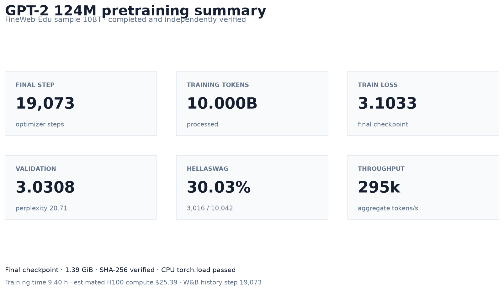
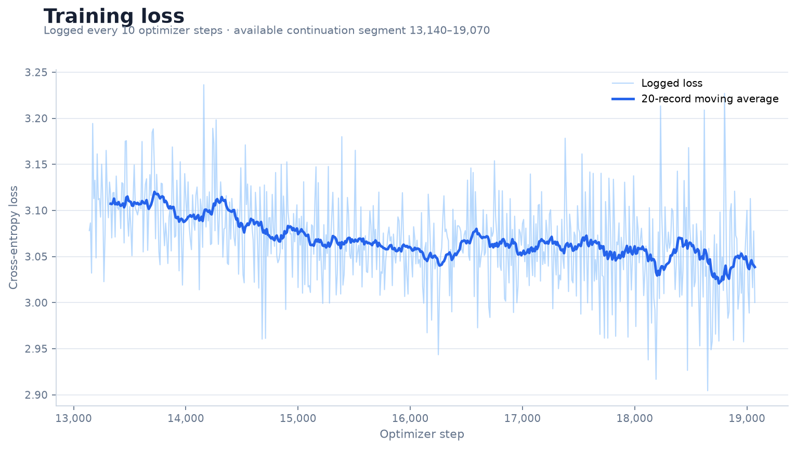
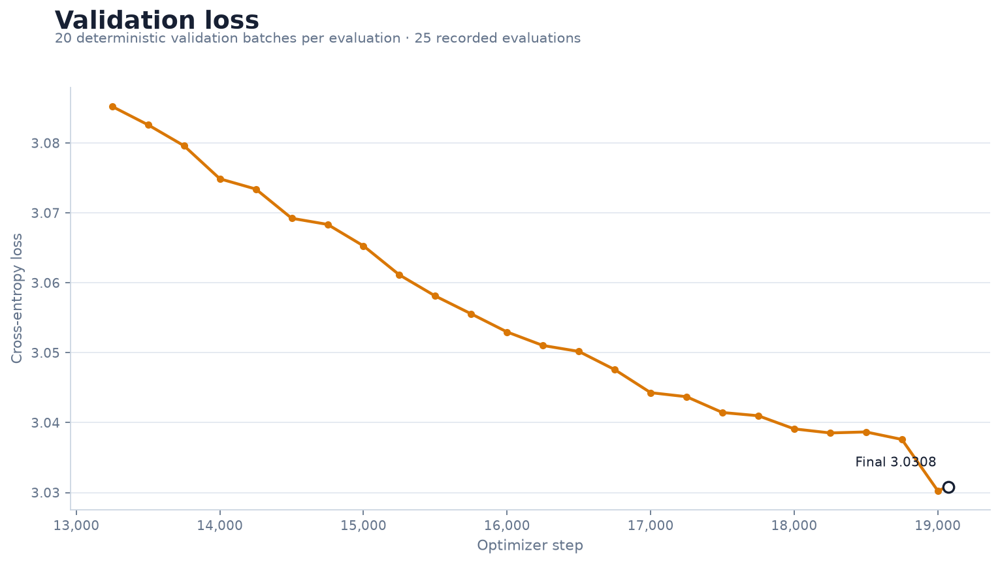
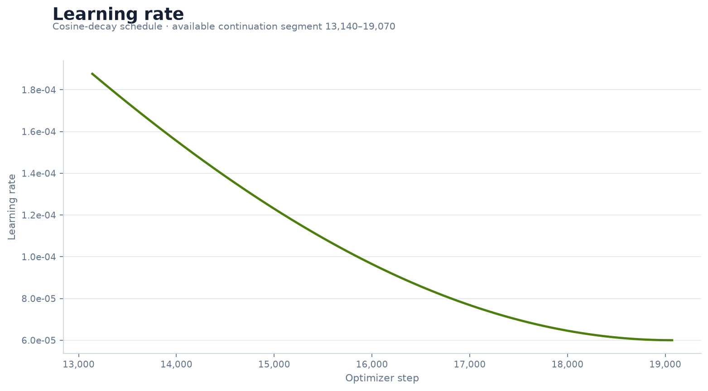
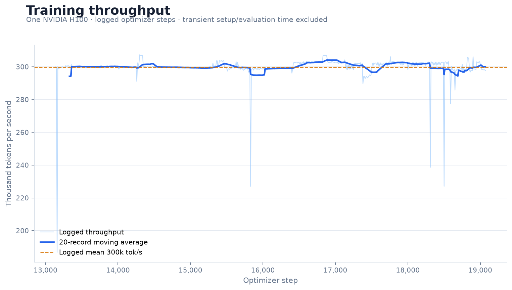
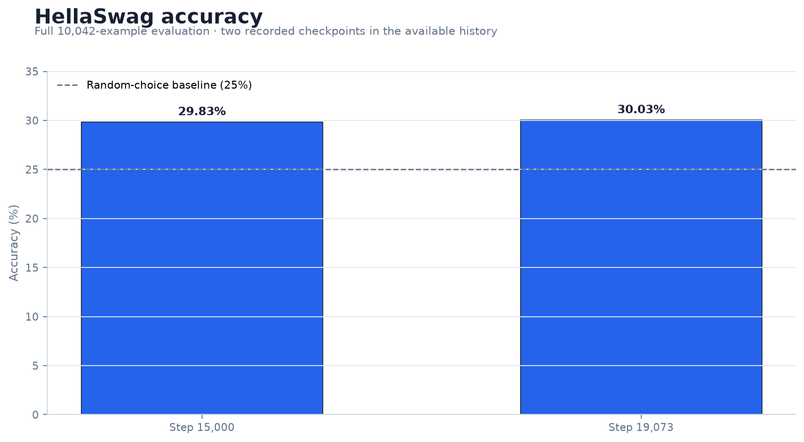

# GPT-2 124M from scratch on FineWeb-Edu

This repository implements and pretrains the GPT-2 small architecture from random initialization. The completed production run processed **9,999,745,024 tokens** from FineWeb-Edu `sample-10BT` on a single NVIDIA H100 and reached optimizer step **19,073**.

> [!IMPORTANT]
> This is a **base text-completion model**, not a chatbot. It was not instruction-tuned, preference-aligned, or safety-tuned. Given a prompt, it continues text; it should not be expected to follow conversational instructions reliably.



## Final results

| Metric | Result |
|---|---:|
| Parameters | 124,475,904 |
| Optimizer steps | 19,073 |
| Training tokens | 9,999,745,024 |
| Final train loss | 3.103327 |
| Final validation loss | 3.030832 |
| Validation perplexity | 20.714451 |
| HellaSwag accuracy | 30.0339% (3,016 / 10,042) |
| Cumulative training time | 9.402 hours |
| Aggregate throughput | 295,441 tokens/s |
| Estimated H100 compute | $25.39 |

The completed [Weights & Biases run](https://wandb.ai/ctxnn-thapar-university/gpt2-from-scratch/runs/65e78f54c14046ef99e04e12e7b3e810) is marked `finished` and reaches history step 19,073. Machine-readable results are available in [final_metrics.json](results/final_metrics.json), [final_checkpoint.json](results/final_checkpoint.json), and [training_history.csv](results/training_history.csv).

**Hugging Face model:** [ctxnn1/gpt2-124m-fineweb-edu-10b](https://huggingface.co/ctxnn1/gpt2-124m-fineweb-edu-10b)

## Training curves

The committed history contains the final continuation segment rather than every earlier scalar row. Continuous plots therefore label their observed step range explicitly; final metrics come from the verified step-19,073 checkpoint and final evaluation records.

| Training loss | Validation loss |
|---|---|
|  |  |

| Learning rate | Training throughput |
|---|---|
|  |  |



The charts are reproducible offline from the committed JSON and CSV artifacts:

```bash
python scripts/plot_training_results.py
```

## Model architecture

The implementation follows the GPT-2 small/124M decoder-only Transformer design.

| Component | Configuration |
|---|---:|
| Transformer blocks | 12 |
| Attention heads | 12 |
| Embedding width | 768 |
| MLP width | 3,072 |
| Context length | 1,024 tokens |
| Vocabulary | 50,304 entries (GPT-2 vocabulary padded for efficiency) |
| Positional encoding | Learned absolute embeddings |
| Normalization | Pre-layer normalization |
| Activation | GELU |
| Weight tying | Token embedding and language-model head |

The training code includes causal multi-head self-attention, GPT-2 residual projection scaling, fused AdamW when supported, gradient accumulation, bfloat16 autocasting, gradient clipping, cosine learning-rate decay, deterministic validation, HellaSwag evaluation, and resumable checkpointing.

## Dataset and training configuration

- **Dataset:** `HuggingFaceFW/fineweb-edu`, configuration `sample-10BT`
- **Tokenizer:** GPT-2 `tiktoken`
- **Shard format:** NumPy `uint16`, 100,000,000 tokens per full shard
- **Prepared data:** 100 verified shards, approximately 19.9 GB
- **Effective batch:** 524,288 tokens per optimizer step
- **Micro-batch:** 16 sequences × 1,024 tokens
- **Precision:** bfloat16
- **Maximum learning rate:** `6e-4`
- **Minimum learning rate:** `6e-5`
- **Warmup:** 715 steps, followed by cosine decay
- **Weight decay:** 0.1
- **Gradient clipping:** 1.0
- **Seed:** 42
- **Compilation:** disabled for the production run

The dataset was tokenized once and uploaded progressively to S3-compatible object storage. Every shard was reopened, checked as readable `uint16`, hashed, uploaded, remotely size-verified, and recorded in a manifest before the dataset `COMPLETE` marker was written.

## Hardware

Production training used exactly **one NVIDIA H100**. The completed checkpoint records 33,846.821 seconds of cumulative training time and an aggregate 295,441 tokens/s. At the observed batch rate of $0.045 per H100-minute, that corresponds to an estimated $25.39 of metered training compute.

## Checkpoints and exact resume

Checkpoints contain everything required to continue the same optimization trajectory:

- model weights and optimizer state;
- completed optimizer step and processed-token count;
- data-loader shard and position state;
- CPU and accelerator RNG state;
- resolved configuration, Git SHA, and W&B run ID.

Local checkpoints are written atomically. Cloud synchronization calculates SHA-256 locally, uploads with bounded retries, verifies remote size, publishes a checksum sidecar, and advances `LATEST.json` only after verification. Resume downloads retain a `.part` file, use ranged requests after interruption, verify size and SHA-256, and rename atomically before `torch.load`.

The final checkpoint is:

```text
s3://gpt2-fineweb10b/training/gpt2-124m-fineweb10b-20260729t103500z-36bfc9e/checkpoints/final_step_019073.pt
```

- Size: `1,493,919,114` bytes
- SHA-256: `e519d993d20c98c841ef061f76a1dec3e6ee24d5e55162bdea2a3e2da280fd40`
- CPU `torch.load`: verified

The native training checkpoint remains in private project storage. A vocabulary-trimmed, standard Transformers export is available publicly on [Hugging Face](https://huggingface.co/ctxnn1/gpt2-124m-fineweb-edu-10b).

## Hugging Face export

The reproducible converter is [scripts/export_hf_model.py](scripts/export_hf_model.py). It maps the native PyTorch model into `GPT2LMHeadModel`, transposes native `Linear` projection weights for Hugging Face `Conv1D`, trims the 50,304-row training embeddings to the 50,257-token GPT-2 vocabulary, and preserves tied input/output embeddings.

Install the export dependencies and create a local export with:

```bash
python -m pip install -r requirements-hf-export.txt
python -m scripts.export_hf_model \
  --checkpoint /path/to/final_step_019073.pt \
  --complete /path/to/COMPLETE.json \
  --checkpoint-record results/final_checkpoint.json \
  --metrics results/final_metrics.json \
  --output-dir /tmp/gpt2-hf-export \
  --license mit
```

The published `model.safetensors` contains 124,439,808 parameters and has SHA-256 `6260e630dd15c0f942423d8319428922155b03fbd37e38dc84470a88b95afe6d`. The converter verifies the source checkpoint, parameter mapping, finite values, native/Hugging Face logits and next-token loss, tokenizer parity, clean-process loading, CPU generation, and generated token bounds before publication. See [huggingface_export.json](results/huggingface_export.json) for the machine-readable validation record.

## Engineering failures and recovery

The run completed through a sequence of infrastructure failures without restarting training from random initialization:

1. The first tokenized dataset could not fit in the batch artifact channel. Dataset persistence moved to progressive S3 uploads with per-shard verification and a final manifest.
2. Early dataset retries exposed runtime-image, tokenizer-resource, and workspace constraints. The final preparation path restored the original ordered FineWeb loader/tokenizer behavior and retained verified shards remotely.
3. Training was healthy when a checkpoint synchronizer lost a response stream while rereading a large remote checkpoint. Verification was changed to local SHA-256 plus remote size/checksum-sidecar checks, eliminating unnecessary full-object rereads.
4. Checkpoint uploads, pointer publication, and remote resume downloads gained bounded retry and resumable-transfer behavior. A transient sync failure could no longer immediately terminate healthy training.
5. Continuation jobs restored the latest verified checkpoint—including optimizer, loader, RNG, processed-token count, and W&B identity—and resumed at `completed_step + 1`. The same run ultimately reached step 19,073 and published the final `COMPLETE` marker.

This recovery design is why partial infrastructure failures cost runtime but did not discard learned state or change the training run identity.

## Generated samples

Fixed-seed examples were generated from the independently downloaded and verified final checkpoint. The full set and reproduction settings are in [generated_samples.md](results/generated_samples.md).

**Prompt:** `The future of artificial intelligence is`

> The future of artificial intelligence is also expanding. As artificial intelligence and its algorithms have increasingly grown, the field continues to rely heavily on human experts and computer vision researchers to guide its operations...

**Prompt:** `To solve a difficult problem, first`

> To solve a difficult problem, first evaluate the problem. A good method to help the system identify, solve, and resolve any problem is to first define “problems” using a given number concept...

## Running locally

Install the base and development dependencies:

```bash
python -m pip install -r requirements-dev.txt
```

Run the network-free CPU smoke test:

```bash
python train_gpt2.py --smoke-test --benchmark-steps 1
```

Run the production configuration against prepared local data:

```bash
python train_gpt2.py \
  --config configs/gpt2_124m_fineweb10b.yaml \
  --data-root /data/edu_fineweb10B \
  --output-dir /outputs/gpt2-124m
```

Resume from a verified checkpoint:

```bash
python train_gpt2.py \
  --config configs/gpt2_124m_fineweb10b.yaml \
  --data-root /data/edu_fineweb10B \
  --output-dir /outputs/gpt2-124m \
  --resume /outputs/gpt2-124m/checkpoints/checkpoint_step_010000.pt
```

`torch.compile` is never enabled silently. Opt in with `--compile`, and benchmark it before a production run.

## Limitations

- This is a small, 124M-parameter base model trained for one approximately 10B-token pass; it is not competitive with modern large language models.
- It is not instruction-tuned or aligned and should not be deployed as a chatbot.
- Generated text can be incorrect, inconsistent, biased, unsafe, or copied in style from pretraining data.
- HellaSwag accuracy is 30.03%, only modestly above the 25% random-choice baseline.
- The committed scalar history covers the final continuation segment; the final checkpoint, final evaluation rows, and W&B history provide the authoritative terminal values.
- The run did not include a comprehensive safety, bias, memorization, or downstream-task evaluation.
- The native optimizer checkpoint remains private; the public Hugging Face repository contains inference weights only and cannot resume the original optimizer state.

## Reports

- [Final training report](reports/training_report.md)
- [Final metrics](results/final_metrics.json)
- [Final checkpoint record](results/final_checkpoint.json)
- [Repository audit](reports/repository_audit.md)
- [Pretraining preparation summary](reports/pretraining_preparation_summary.md)
